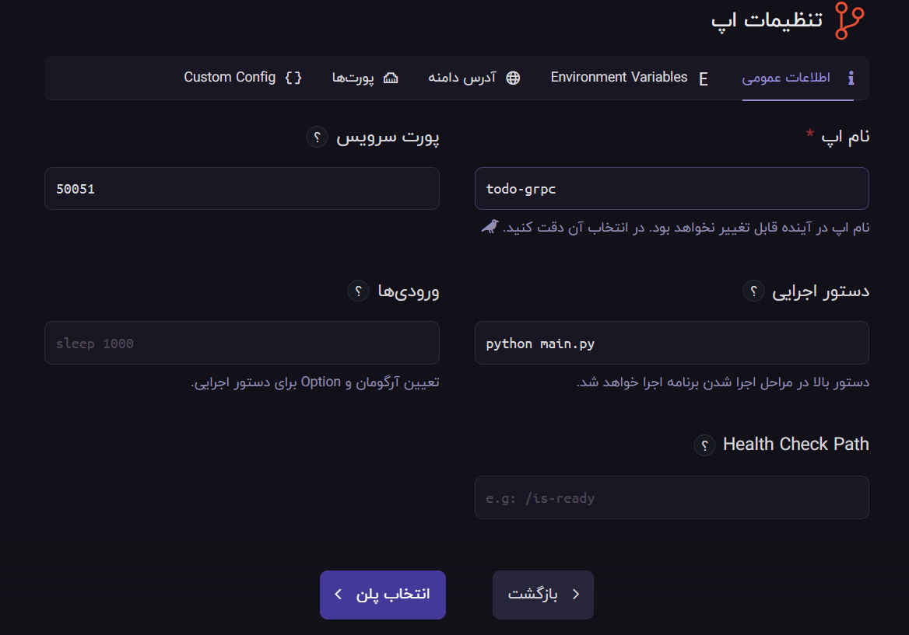

<div align="center">
<h1 align="center">Hamravesh deployment</h1>
</div>


# Guideline
- [Guideline](#guideline)
- [Create an Account](#create-an-account)
- [Setup Database](#setup-database)
- [Setup kong](#setup-kong)
- [Setup grpc Service](#setup-grpc-service)
  - [setup repo app](#setup-repo-app)
  - [setup general info](#setup-general-info)
  - [setup environments](#setup-environments)
  - [pick a plan](#pick-a-plan)
- [Setup API Service](#setup-api-service)


# Create an Account
in order to deploy your project inside hamravesh first you need to create an account. so please go to the following url and create your account.

<https://console.hamravesh.com/signup>

after that you need to sign in to your console panel. which is going to be like this.
<div align="center" ></div>

# Setup Database

follow the provided steps to finish this section.


surely you are going to need a postgres database for your deployment so all you have to do is to create a postgres app first.
in the app section click on the PostgreSQL database.

<div align="center" ></div>

then in the next window pick a name for the database service name.

<div align="center" ></div>

Note: in our case we dont need to access the database through the internet.

after that just choose a plan for it and create the database instance.
<div align="center" ></div>

now that your database is created you can use it for connecting other apps to it.
<div align="center" ></div>

the provided database credentials and url are as follows:
``` properties
PGDB_address: APP-NAME.bigdeliali3.svc:5432
PGDB_username: postgres
PGDB_password: ddGrZM7u3BsduXm5ph3WzPYlMWSMTXbu
```
Note: if you dont want to use the default database by the name of postgres,
you just have to head to the terminal tab and create a another database for your project you can call it anything you want.

<div align="center" ></div>

```shell
psql -U postgres -c "create database <PGDB_name>"
```
# Setup kong
in order to setup the kong you can use the following url which will give you the instructions of deployment in declarative mode or with primate and database.

<https://github.com/AliBigdeli/ApiGateway-Hamravesh-Docker-Kong-Template>

# Setup grpc Service
grpc server is going to be our actual connector to the database and crud operations.

## setup repo app
in order to deploy your project you can use repo mode (or منبع گیت) after clicking on the item. you will see a panel like this below:

<div align="center" ></div>

## setup general info 

<div align="center" ></div>

in this page you have to provide general information's about the app you are about to create, which in my case are as follows:

```
app_name: APP-NAME # name of the app which is going to be called inside the portal
service_port: 50051 # which we declared in the app
execute_command: python main.py
```

Note: provided information is just enough to run our program for more details please visit this url https://docs.hamravesh.com/darkube/create/git-repo/settings/general/

## setup environments

<div align="center" ></div>

in this section you have to provide the environment variables which are going to be used in the project. you can switch to editor and pase our template that is placed in /envs/prod/.env.sample

Note: provided information is just enough to run our program for more details please visit this url https://docs.hamravesh.com/darkube/create/git-repo/settings/envs/


## pick a plan


<div align="center" ></div>

for launching purposes you have to pick a plan for resources. based on the scale and traffic of your project you have to pick one.

and lastly wait till its up and running then you can make requests to it from fastapi service.

# Setup API Service
you can use the following repo as a reference of deploying fast api application in hamravesh:

<https://github.com/AliBigdeli/FastApi-Hamravesh-Docker-Template>